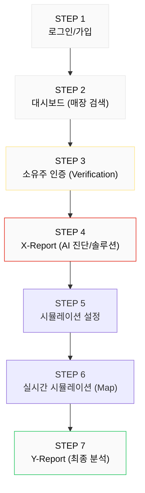
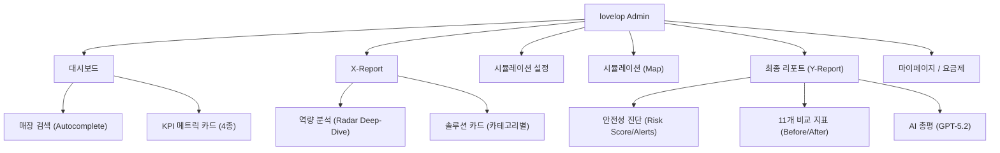

# 로벨롭(lovelop) 와이어프레임 명세서 (v2.0)

## 1. 서비스 흐름도

---

## 2. 전체 네비게이션 구조

---

## 3. 화면별 레이아웃 명세

### 3.1 Screen — 대시보드 (Dashboard)
- **매장 검색**: 2글자 이상 입력 시 Autocomplete 드롭다운 노출. 매장명/주소 포함.
- **KPI 카드**: 분석 매장 수, 평균 감성 점수, 에이전트 수, 평균 객단가 (트렌드 포함).
- **사이드바**: 로고(v2), 메뉴 5종, 마이페이지/크레딧 정보 및 충전 버튼.

### 3.2 Screen — 소유주 인증 (Verification)
- **지도 섹션**: Kakao Map API 연동, 매장 위치 마커 표시.
- **인증 폼**: 사업자등록번호(10자리) 입력 필드 + 인증 버튼.

### 3.3 Screen — X-Report (AI 진단)
- **역량 분석**: 인터랙티브 Radar Chart. 항목 클릭 시 우측에 상세 인사이트(키워드/AI분석) 동적 업데이트.
- **솔루션 리스트**: 3개 카테고리(접점 확대/공간 경험/운영 효율)별 카드 배치.
- **솔루션 카드**: 호브 시 '실행 방법' 및 '기대 변화' 상세 노출. 다중 선택 가능.

### 3.4 Screen — 시뮬레이션 설정 & Map
- **설정**: 시뮬레이션 기간(1주~1년) 선택에 따른 크레딧 차등 차감. 선택된 솔루션 요약 노출.
- **실시간 지도**: Mapbox 기반 Dark 모드. 에이전트(상주/유동) 이동 애니메이션.
- **오버레이**: 현재 시뮬레이션 시간, 에이전트 수, 상태(수집 중/준비 완료) 실시간 표시.

### 3.5 Screen — Y-Report (최종 리포트)
- **안전성 진단**: Risk Score(0-100), 역효과 경고 알림(Alert), 트레이드오프(얻은 것 vs 잃은 것) 요약.
- **11개 핵심 지표**:
  1. 기본 방문 (Total Visits/Market Share)
  2. 키워드 (WordCloud 비교) & 평점
  3. 시간대별 트래픽 (Hourly Traffic Bar Chart)
  4. 세대별 증감 (Gen Impact)
  5. 방문 목적 (Purpose Analysis Table)
  6. 재방문율 (Retention/Churn)
  7. 경쟁 매장 비교 (Benchmark Unit Bar)
  8. AI 총평 (Markdown)
  9. 에이전트 유형 (Resident/Floating)
  10. 성별 구성
  11. 세대×목적 크로스탭 (Heatmap)

### 3.6 Screen — 마이페이지 & 요금제
- **마이페이지**: 내 매장 정보(지도 포함), 멤버십 상태, 리포트 보관함.
- **요금제**: 구독 플랜 4종(Basic/Premium/Pro/Master) + 크레딧 개별 충전 팩.

---

## 4. 디자인 토큰 (Swiss Clean v2)

| 토큰 | 값 | 비고 |
|------|-----|------|
| Primary Red | `#E42313` | 포인트 컬러 |
| Success Green | `#10B981` | 긍정 지표/완료 |
| Info Blue | `#3B82F6` | 시뮬레이션/상주 |
| Warning Amber | `#F59E0B` | 시간대/주의 |
| Corner Radius | `0.75rem ~ 1.5rem` | v2에서는 모서리 곡률 적용 |
| Heading Font | Space Grotesk | 대시보드/숫자 전용 |
| Body Font | Pretendard/Inter | 기본 가독성 폰트 |

---

## 5. 참조 파일

- **프론트엔드 메인**: `App.jsx`
- **시뮬레이션 렌더러**: `SimulationMap.jsx`
- **프로젝트 개요**: `PROJECT_OVERVIEW.md`
- **호환성 보고서**: `backend_frontend_compatibility.md`
